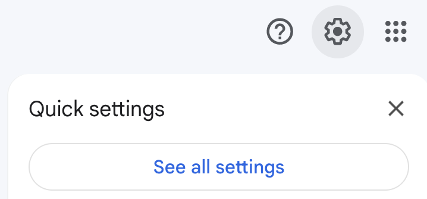
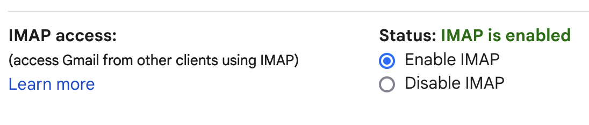

# Mega Helper Scripts

Scripts and methods to help you manage your [Mega](https://mega.nz) accounts.

This repo is designed and tested for use with macOS but will probably work just fine with Linux and likely work fine on Windows with WSL2. Maybe I will even test it on those platforms soon.

**WARNING:** None of the methods here are guaranteed to work or to not cause anything bad to happen. Use at your own risk. It worked for me, I hope it might work for you.

## Preparation

Install `megatools` ([homepage here](https://megatools.megous.com/), [old outdated repo here](https://github.com/MaxFork/MegaTools))

(macOS)

```bash
brew install megatools
```

Test that its working

```
$ megatools --version

Usage:
...
Run: megatools <command> --help for detailed options for each command.

megatools 1.11.1 - command line tools for Mega.nz
Written by Ondrej Jirman <megous@megous.com>, 2013-2022
Go to http://megatools.megous.com for more information
```

## Login to all of your accounts

The included script `login.sh` will do a simple basic login on all of your accounts listed in the file `logins.txt`. This is helpful in order to easily "refresh" or "revive" your account after it has been inactive for a long time (and could get deleted due to inactivity).

First, replace the contents of the included file `logins.txt` with your user account credentials. Make sure you edit the file with a plain-text editor such as Notepad or TextEdit or VS Code, etc.. The format of the file contents should look like this

```
myemail@gmail.com:hunter2
myemail+1@gmail.com:hunter2
```

Where the first value on each line is your Mega login email address, the second value is your password, delimited by a `:` character. Yes, we are saving our Mega account passwords in plain text in a file on disk because we assume you do not actually care about the security of your account or its contents.

Run the script with this super simple command

```bash
./login.sh
```

Should look like this

```
>>> logging in to account: myemail@gmail.com
successful login
```

If you get an error message like this

```
ERROR: Can't login to mega.nz: API call 'us' failed: Server returned error ENOENT
ERROR: couldnt log in to myemail@gmail.com
```

Then it means your username and/or password is wrong.


## Register new accounts

This method is a little tricker than the previous one and I have not been able to 100% script it up yet (any help is appreciated). But the goal here is to use the "+"-trick with Gmail to create a bunch of new accounts easily.

First, you should create for yourself a "burner" Gmail account. You will need to enable 2-factor authentication (2FA) on it for the latter steps. Its also really really helpful if this account has a mostly empty Inbox with contents that you do not care about and are not sensitive and would not mind losing if anything bad were to happen.

Next, you should update the included file `password.txt` with the password that you want to use for your NEW **Mega** accounts. To make life easier, you can use a long string of random numbers and letters, but consider avoiding special characters and especially avoid including the character `:` because that is used elsewhere.

Now you can use the included script `register.sh` to create a bunch of new accounts. You will use the script by providing it with the base name of your email address, and the start and stop numbers to append to the address for registration. So, if your email address is `myemail@gmail.com` and you want to create 5 Mega accounts starting at number `1` and ending at number `5` then you will run the script like this

```bash
./register.sh myemail 1 5
```

If it works, it should give output like this

```
>>> Registering account for user myemail+1@gmail.com
Registration email was sent to myemail+1@gmail.com. To complete registration, you must run:

  megatools reg --verify FW...... @LINK@

(Where @LINK@ is registration link from the 'MEGA Signup' email)
success
>>> Registering account for user myemail+2@gmail.com
Registration email was sent to myemail+2@gmail.com. To complete registration, you must run:

  megatools reg --verify FW...... @LINK@

(Where @LINK@ is registration link from the 'MEGA Signup' email)
success

```

The script will also create / update the new file `registered_users.txt` which you can open to see the list of new accounts that were created (username, password, and token).

Congrats you just created a bunch of new Mega accounts!

## Verify the new accounts

The hardest part is performing the verification step on these accounts. To verify, you would normally need to click through the link sent in the email. However, because we just created hundreds of new Mega accounts, we dont have time to click a hundred email links. So, we are going to configure our email so that we can pull it down on the command line and dump it out and scrape it to get the verification links back.

### Configure Gmail

First, you need to log in to your Gmail account, and make sure you have enabled 2FA ;

- https://myaccount.google.com/security

Next, you need to create an App Password for Gmail

- https://myaccount.google.com/apppasswords

- having trouble? some helpful links;
  - https://support.google.com/accounts/answer/185833
  - https://support.google.com/accounts/answer/185833?hl=en
  - https://support.google.com/mail/thread/4477145/no-app-passwords-under-security-signing-in-to-google-panel?hl=en

Save your app password in plain text somewhere handy because you will be copy/pasting it into the terminal soon. The app password will be a 16-digit string; make sure to remove all the spaces in it. No spaces allowed despite the fact that Google displays it with spaces.

Next, you need to enable IMAP access to your Gmail Inbox

- find the section for "See All Settings"



- go to "Forwarding and IMAP"


- enable IMAP Access



- need help? try some of these;
  - https://support.google.com/mail/answer/7126229
  - https://support.google.com/mail/answer/7104828?hl=en&ref_topic=7280141&sjid=7499020491168243840-NC
  - https://www.socketlabs.com/blog/smtp-or-imap/

OK great now we have IMAP enabled on our Gmail inbox. This will let us retrieve our emails from the computer, without needing to use the Gmail website in the web browser.

### Configure `mutt`

To retrieve our emails, we are going to use the program `mutt`. Install it if its missing from your computer;

(macOS)

```bash
brew install mutt
```

The program `mutt` can be configured with a file named `~/.muttrc` or `~/.mutt/muttrc`.There is a template version included here in the repo, called `muttrc`. Now you should first edit this template file.

In the included file `muttrc` you should fill in these two lines with your values

```
set imap_user = "myemail@gmail.com"
set imap_pass = "app-password-goes-here"
```

Insert your Gmail account username, and the App Password that you got from Gmail. Save the changes to the file.

Now we will copy and rename the file to our home directory ; make sure you do not already have a copy of the file beforehand! If so then rename the old one and move this one in its place.

Copy the `muttrc` file like this

```bash
cp muttrc ~/.muttrc

# for good measure lets pre-create the other mutt dir as per the config
mkdir ~/.mutt
```

Now, if it worked properly, you can finally start the program;

```bash
mutt
```

If it worked, you should see it logging in to your email account and pulling down your inbox contents.
  - Note that since we only enabled IMAP at login, not offline, and we did not enable SMTP, it *should* only be able to read your emails, not propgate changes back to your Inbox... I think.

You should now see `mutt` take over your entire screen with its interactive terminal-based email client. The next step is to Tag all emails that contain the word "Mega", and Save them to a file.

Take the following actions;

- press `<shift>+T` to open the "Tag" search prompt
- type the word "MEGA" and press `<enter>` and you should see a `*` appear next to all the matching emails (and ones offscreen)
- now press `;` to open the `tag-` command prompt
- now type `s` to bring up the "save file" prompt; it will fill in with a default filename such as `welcome=`, you can just press Backspace until you delete the name, and enter a new file name such as `mega_emails.txt` and press `<enter>`
- at the confirmation prompt ("Create mega_emails.txt?") type `y`, and the emails will be exported from your `mutt` Inbox to the file you specified
- to quit mutt, press `q`, and when it asks if you want to delete purged emails, just say `n` for "no"

Congrats you will now have a file called `mega_emails.txt` saved in the current directory with the contents of every email that has "MEGA" in it. We will use this for the next step.


#### `mutt` Resources

- http://www.mutt.org/
  - http://www.mutt.org/doc/manual/#commands
  - http://www.mutt.org/doc/manual/#configuration
  - http://www.mutt.org/doc/manual/#patterns
- https://github.com/JoshuaEstes/CheatSheets/blob/master/mutt.md
- https://askubuntu.com/questions/105045/how-do-i-parse-emails-with-mutt#105049

### Parse the emails

Next we need to scrape the dumped emails to extract the matching email addresses, and their URL's for verification links.

We will do that with the included Python script (make sure you have Python 3 installed)

```bash
./search.py mega_emails.txt > mega_email_links.txt
```